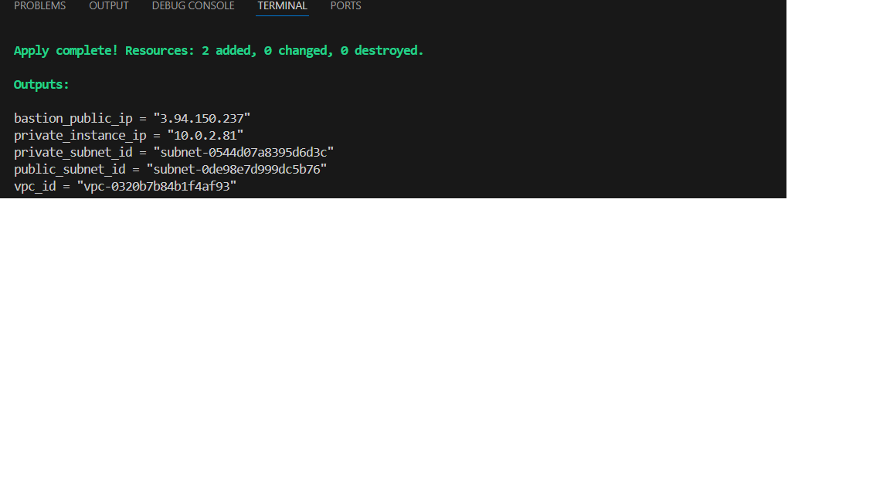
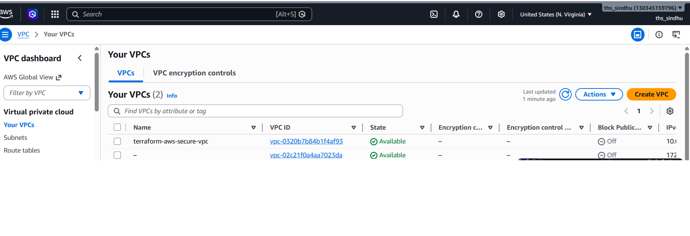
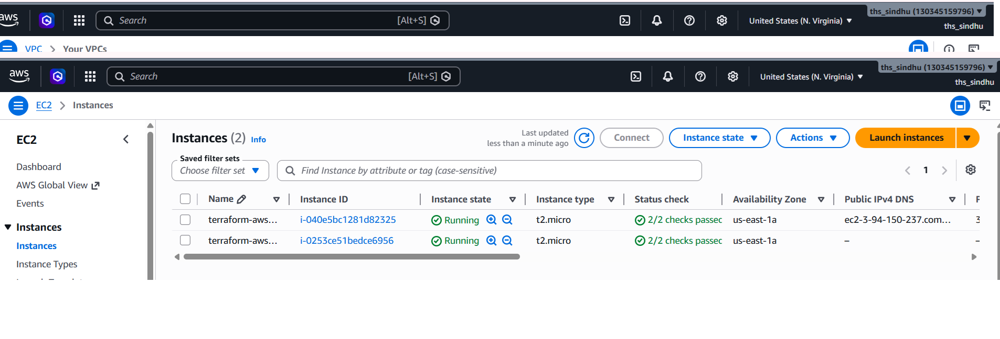
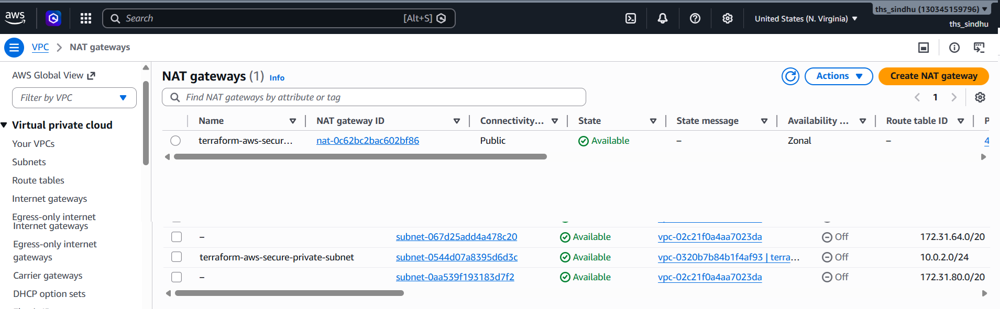

# Terraform AWS Secure Infrastructure

## Project Overview
This project automates AWS infrastructure deployment using Terraform, demonstrating Infrastructure as Code (IaC) principles.

## Architecture
- Custom VPC (10.0.0.0/16)
- Public Subnet with Bastion Host
- Private Subnet with EC2 Instance
- Internet Gateway
- NAT Gateway
- Route Tables
- Security Groups

## Prerequisites
- Terraform v1.0+
- AWS CLI configured
- AWS Account

## Project Structure
terraform-aws-secure-infrastructure/
├── main.tf
├── variables.tf
├── outputs.tf
├── terraform.tfvars
├── modules/
│   ├── vpc/
│   ├── subnet/
│   ├── security-group/
│   └── ec2/
├── screenshots/
└── docs/

## How To Use

### Step 1 - Initialize
terraform init

### Step 2 - Plan
terraform plan

### Step 3 - Apply
terraform apply

### Step 4 - Destroy
terraform destroy

## Screenshots

## Technologies Used
- Terraform
- AWS VPC
- AWS EC2
- AWS NAT Gateway
- AWS Security Groups

## Author
Your Name - DevOps Engineer